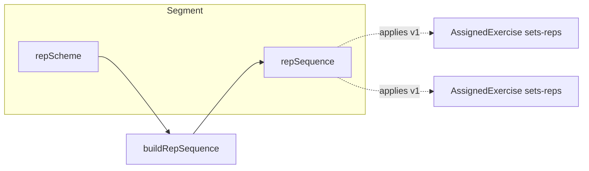

# Data Model: Workout Segment Repetition Generation

**Feature**: [spec.md](./spec.md)  
**Parent domain**: [002 Fitness Workout Builder – data model](../002-fitness-workout-spec/data-model.md)

---

## Overview

This feature **extends** the existing **Segment** entity with optional metadata describing **how** per-round repetitions are generated for **sets/reps** exercises in that segment. The **canonical output** is an integer array **`repSequence`** of length **`rounds`**, shared by all qualifying assigned exercises.

It does **not** replace `segmentType` (custom, emom, amrap, …).

---

## Types

### `RepSchemePattern`

```ts
type RepSchemePattern = 'linear' | 'pyramid' | 'fixed'
```

### `RepSchemeConfig`

User-facing inputs (may include fields corrected on blur). Stored on the segment or nested under `repScheme`.

| Field | Type | Required | Notes |
|-------|------|----------|--------|
| `pattern` | `RepSchemePattern` | yes | |
| `rounds` | `number` | yes | **Must** match `segment.rounds` when `segment.rounds` is already defined for timing (see [research.md](./research.md)). |
| `start` | `number` | linear / pyramid | Starting reps. |
| `end` | `number` | linear | May be **auto-corrected** on blur. |
| `peak` | `number` | pyramid | May be **auto-corrected** on blur. |
| `reps` | `number` | fixed | Constant reps per round. |

### `RepSequence`

- **Name**: `repSequence`  
- **Type**: `number[]`  
- **Invariant**: `repSequence.length === rounds` (after successful generation).  
- **Invariant**: every element is an integer (JavaScript safe integers; practically small).  
- **Location**: **`Segment.repSequence`** (canonical for v1).

---

## Entity: Segment (extensions)

Add optional fields:

| Field | Type | Purpose |
|-------|------|---------|
| `repScheme` | `RepSchemeConfig \| undefined` | Last committed user inputs after blur correction. |
| `repSequence` | `number[] \| undefined` | Generated integers per round; drives preview and future “apply” behavior. |

**Relationship**

- `Workout` 1—* `Segment` (unchanged).
- `Segment` 1—* `AssignedExercise` (unchanged).
- `repSequence` applies to **each** `AssignedExercise` where `exercise.prescription.mode === 'sets-reps'` and the segment is **in scope** for rep UI (see spec).

---

## Entity: AssignedExercise (behavior, v1)

No **required** new fields for v1 if `repSequence` lives on `Segment`.

**Optional future extension**: `repetitionsByRound?: number[]` if per-exercise overrides are added later—**out of scope** for v1.

**Interaction with `repetitions`**

- Until board/timer understand per-round arrays, implementation may set `repetitions` to a **single** representative value (e.g. first round) or leave unchanged—**document in tasks**; spec priority is builder preview + correct `repSequence`.

---

## Validation / correction policy

| Pattern | When | Behavior |
|---------|------|----------|
| `linear` | blur | Auto-correct `end` (and implicitly `step`) per normative rules; no user-facing errors. |
| `fixed` | blur | Clamp/coerce `reps` to integer if needed (e.g. parse from input); no error spam. |
| `pyramid` | blur | Auto-correct `peak` per integer step rules; **`rounds` odd** enforced by UI, not silent fix. |
| `pyramid` | even rounds | **Prevent** in UI; service may return `ok: false` if called defensively. |

---

## Totals

- `sumRepSequence = repSequence.reduce((a, b) => a + b, 0)`  
- `setsRepsCount =` count of assigned exercises with `sets-reps` mode in segment.  
- `segmentTotalReps = sumRepSequence * setsRepsCount` (v1 definition).

---

## State transitions (conceptual)

1. User edits scheme fields (dirty local state allowed).
2. **Blur** → run correction + `buildRepSequence` → persist `repScheme` + `repSequence` on `Segment`.
3. Preview reads `repSequence` (or local mirror immediately after blur).

---

## Diagram


